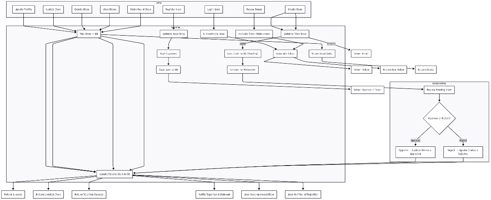

# 🔎 Lost & Found Portal with Approval Workflow

A Lost & Found Management System where:
- Users can report lost or found items.
- Reports are first marked as Pending and must be approved/rejected by a Moderator/Admin.
- Once approved, items become public.
- Any user can claim an approved item → status changes to Claimed and a notification is triggered.

---

## 🚀 Features
- User authentication (JWT-based)
- Role-based access control (`user` / `admin`)
- CRUD operations for lost & found items
- Workflow states: `Pending → Approved → Claimed / Rejected`
- Moderator dashboard APIs for approvals/rejections
- Claim workflow for users
- Notification endpoint (console log or toast)
- MongoDB Cluster database with user & item models

---

## 🖼️ Workflow




---

## ⚙️ Tech Stack
- **Backend:** Node.js + Express
- **Database:** MongoDB + Mongoose
- **Authentication:** JWT
- **API Testing:** Postman
- **Frontend (future):** React / Angular (Moderator Dashboard)

---

## 📥 Installation

```bash
# Clone repository
git clone https://github.com/your-username/lost-found-portal.git

# Install dependencies
cd server
npm install
for run
nodemon

cd client
npm install
for run
npm start

# Set environment variables
cp .env.example .env

